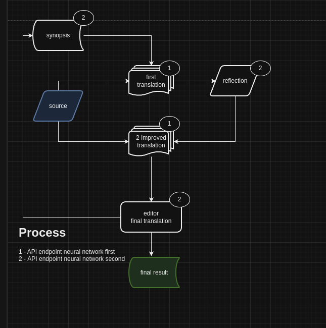

## English , translated
# Sunny Narrator is an early-stage AI translator for long texts
such as books in FB2, EPUB, or TXT format. The result is a reasonably readable text. 
However, for some languages, a character’s gender may accidentally switch in different chapters if it’s not clearly established, and some artifacts may remain. 
The translation is performed in multiple passes using different roles (translation with synopsis previous part , translation corrections, and proofreading), 
and it almost needs human proofreading and editing as well. Prompts for translation are located in the `.srcs/utils.py` file in English, and for use with Qwen/Deepseek, they should be rewritten in Chinese.

**To use the translator, you’ll need:
1. A host address and API key for an OpenAI-compatible API (i.e., you can locally run llama.cpp or use the address and key for OpenAI, Claude, etc.).
2. An FB2 or TXT file. If you have an EPUB file, use an online conversion tool to convert it to FB2. If you don't have specific requirements for translating a book, a TXT file is sufficient.
3. A running program (Docker or installed Python).

Translation is performed in four passes and may require a large number of tokens and time, usually three times more tokens for input and output than the entire text.

**Parameters** (`/.env` or Docker `.env`)
1. Target and source language: the target and source languages.
2. The country for the target language is also important to specify to adhere to the nuances of cultural context during translation.
3. Optionally, two neural networks can be used for translation: one for direct translation and corrections, and the second for evaluating translation quality and proofreading (i.e., optimized for the target language). Specify the same parameters for both neural networks if you only have one, or specify `API_BASE2` for a smarter or more optimized neural network for the target language.
   I use llama.cpp locally and run Mistral 24 Instruct for the main translation and Gemma 27B for proofreading. At a speed of 10 tokens/second, translating books with text around 500KB takes a day.
4. Try to specify a maximum chunk size of no more than 16000 bytes, and 1/3 that amount for the neural network.
   As of May 2025th, the quality of the response slightly degrades (by a few percent) at a context length of more than 8,000 tokens.
5. The `vocabulary` feature  .The `VOCAB` parameter specifies preferred translation pairs in the form of `source_lang=target_lang`, it can be made with NER Spacy feature.
https://github.com/neowisard/sunny_narrator/wiki/Vocabulary

**Launch**

Set the translation parameters in the `.env` file and run the program:

https://github.com/neowisard/sunny_narrator/wiki/Run-It

On the first run, test the program on a file with no more than a hundred words.

**Thanks**
Thanks to [POC](https://github.com/andrewyng/translation-agent) for automated FB2 translation via LLM translation agents.
Qwen – Qwen_Coder32B is wonderful.

**For your information**
This was made for fun and home use. This small project could become a real product, and there are dozens of ideas for improving translation quality. Although commercial services already exist, such as www.inotherword.ai, creating a robust commercial application requires Java, Kafka/RabbitMQ, Postgres, Minio, several specialized LLMs, and can be costly (3–6 months and a few *** thousand dollars).

## Russian (original)

Sunny narrator это ранняя версия AI переводчика длинных текстов, 
например книг в FB2 (EPUB) формате или в формате TXT. 
В результате получается **достаточно** читабельный текст. При этом для некоторых языков в разных главах может случайно переключаться пол героя, если он не явен, а также оставаться некоторые артефакты.  
Перевод выполняется в несколько приемов используя разные роли (перевод, исправления перевода, вычитка), почти всегда нужна вычитка и исправление и человеком также. 
Промты для перевода находятся в файле .srcs/utils.py на английском языке, для использования с Qwen\Deepseek их стоит переписать на китайский.  

**Для работы переводчика вам нужен:**
1. Адрес хоста и ключ API OpenAI совместимого API (т.е. вы можете локально запустить llama.cpp или использовать адрес и ключ OpenAI, Claude etc) 
2. FB2 или TXT файл. Если у вас EPUB файл - воспользуйтесь онлайн конвертацией в FB2. Если у вас нет требований к переводу именно книги - переводите txt файл. 
3. Запущенная программа (docker или на установленном python)
Перевод выполняется в 4 прохода и может потребовать большого количества токенов и времени, обычно в 3 раза больше токенов на вход и выход чем весь текст.   

**Параметры** (/config/.env) или docker .env
1. target and source language = целевой и исходный языки. 
2. Страну для целевого языка также важно указать, чтобы соблюсти основы культурного кода при переводе. 
3. Опционально может использоваться 2 нейросети для перевода, одна из них для непосредственно перевода и внесения исправлений, вторая для выдачи замечаний к качеству перевода и вычитке (т.е. более оптимизированная под целевой язык). Укажите одинаковые параметры для обоих нейросетей если у вас одна, или укажите API_BASE2 для более "умной" или оптимизированной под целевой язык.
    Я использую llama.cpp локально и запускаю mistral24 instruct дя основного перевода и gemma27 it для вычитки. При скорости 10t\s перевод книг с текстом около 500кб занимает сутки.
4. Старайтесь указывать максимальный размер чанка не более 16000 (в байтах), и при этом в 3 раза меньше максимального для данной нейросети. 
    Согласно отчетам на 05.25 качество ответа чуть (few %) деградирует на длине контекста более 8к. токенов.
5. Словари - работают. Создаются руками в файле имя_книги.dic или с помощью NER spaCy, потом исправляются руками  . 
https://github.com/neowisard/sunny_narrator/wiki/Vocabulary

**Запуск**

Укажите параметры для перевода в .env файле, запустите программу. 
https://github.com/neowisard/sunny_narrator/wiki/Run-It

**thx**
Thanx  [POC](https://github.com/andrewyng/translation-agent)  for automated FB2 translation via LLMs translation agent
QWEN - Qwen_Coder32B it wonderful.

**fyi**
It made for fun and home use.
Из данной поделки можно сделать реальный продукт и есть десятки идей по улучшению качества перевода. Хотя уже существуют коммерческие сервисы для этого , например www.inotherword.ai . 
For commercial use need to made real software via Java, Kafka\RabbitMQ, Postgres, Minio, few specialized LLMs and it can be cost (3-6 month and few kkk dollars).

## Chinese translated

Sunny Narrator 是一个用于翻译长文本（例如 FB2、EPUB 或 TXT 格式的书籍）的 AI 翻译器早期版本。
翻译结果通常可读性较好，但可能存在一些问题：对于某些语言，不同章节中角色性别可能会发生意外切换，尤其是在角色性别不明的情况下；并且可能保留一些错误。

翻译过程分为几个步骤，分别由不同的角色（翻译、润色、校对）执行，几乎总是需要人工校对。
翻译提示目前在 .srcs/utils.py 文件中以英文编写，用于配合 Qwen 和 Deepseek 使用，建议将其重写为中文。

**要使用此翻译器，您需要：**
1. OpenAI 兼容 API 的主机地址和 API 密钥（例如，您可以本地启动 llama.cpp，或使用 OpenAI、Claude 等的地址和密钥）。
2. FB2 或 TXT 文件。如果您有 EPUB 文件，请先将其转换为 FB2 格式。如果没有特定要求，建议翻译 TXT 文件。
3. 程序（Docker 或安装的 Python 环境）。
翻译过程分四步进行，可能需要大量的 tokens 和时间，通常输入和输出的 tokens 数量是原文的三倍。

**感谢**
感谢 [POC](https://github.com/andrewyng/translation-agent) 项目提供的自动 FB2 翻译功能。
QWEN (Qwen_Coder32B) 非常出色。

## Portugese , Brasil , translated

Sunny Narrator é uma versão inicial de um tradutor de IA para textos longos, como livros em formato FB2 (EPUB) ou TXT. Como resultado, obtém-se um texto bem legível. Nesses casos, em alguns capítulos, o gênero do personagem pode mudar acidentalmente se não estiver claro, além de permanecerem alguns artefatos. A tradução é realizada em várias etapas, utilizando diferentes processos (tradução, correção de tradução, revisão), e quase sempre precisa de revisão e correção humana.

Os prompts para a tradução estão no arquivo .srcs/utils.py em inglês e, para uso com Qwen/Deepseek, devem ser reescritos em chinês.

**Para usar o tradutor, você precisa de:**

1. Endereço do host e chave de API tipo OpenAI (ou seja, você pode executar o llama.cpp localmente ou usar o endereço e a chave da OpenAI, Claude, etc.).
2. Arquivo FB2 ou TXT. Se você tiver um arquivo EPUB, use a conversão online para FB2. Se não precisar traduzir um livro, use o arquivo TXT.
3. Programa em execução (docker ou Python instalado).

A tradução é realizada em 4 passagens e pode exigir uma grande quantidade de tokens e tempo, geralmente três vezes mais tokens na entrada e saída do que todo o texto.

Ao rodar pela primeira vez, verifique o funcionamento do programa em um arquivo com não mais de cem palavras.

**Agradecimentos** ao [POC](https://github.com/andrewyng/translation-agent) pela tradução automática de FB2 via agente de tradução LLM.

QWEN – Qwen_Coder32B é maravilhoso.

